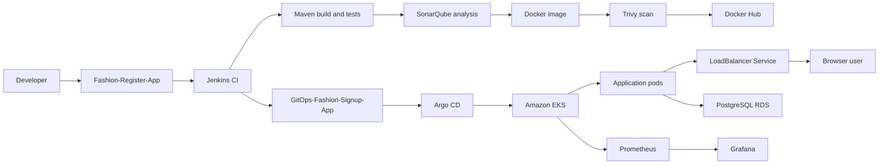

# Fashion Signup App: Project Overview

## Purpose

This project delivers a Java web application through an automated CI/CD and GitOps workflow on AWS. Application source and Kubernetes deployment configuration are maintained in separate GitHub repositories.

## Architecture

```text
Developer
 -> Fashion-Register-App
 -> Jenkins CI
 -> Maven build and tests
 -> SonarQube analysis and quality gate
 -> Docker image build
 -> Trivy vulnerability scan
 -> Docker Hub push
 -> GitOps-Fashion-Signup-App values.yaml update
 -> Argo CD
 -> Amazon EKS
 -> Kubernetes Deployment and Pods
 -> LoadBalancer Service
 -> Browser user
```

The application uses PostgreSQL on Amazon RDS. Database settings are supplied to pods through a Kubernetes Secret. Prometheus and Grafana provide operational visibility.

## Repositories

- `Fashion-Register-App`: Java application, Maven modules, Dockerfile, and Jenkins pipeline.
- `GitOps-Fashion-Signup-App`: Helm chart, deployment values, Deployment template, and LoadBalancer Service template.

## Delivery Flow

1. Jenkins checks out the application repository from `main`.
2. Maven compiles the server and web modules and runs tests.
3. SonarQube analyzes the source and returns the configured quality-gate result.
4. Jenkins builds and scans a Docker image.
5. Jenkins pushes the image tag and `latest` to Docker Hub.
6. Jenkins updates the image tag in the GitOps Helm values file.
7. Argo CD detects the GitOps change and reconciles the Helm release in EKS.
8. Kubernetes rolls out the new pods and exposes the application through the LoadBalancer Service.

## External Access

The Helm chart creates a Kubernetes Service with `type: LoadBalancer`, port `8080`, and target port `8080`. AWS provisions the external endpoint, which forwards browser traffic to the application pods selected by the Service labels.

## Infrastructure

- Amazon VPC, subnets, security groups, EC2, EKS, and RDS PostgreSQL
- Jenkins master and build agent
- SonarQube with PostgreSQL support
- Docker Hub image registry
- Helm and Argo CD
- Prometheus and Grafana

## Ownership Boundaries

- Jenkins owns build, test, analysis, image creation, and the GitOps commit.
- GitHub stores source code and desired deployment configuration.
- Argo CD owns reconciliation from Git to Kubernetes.
- Kubernetes owns scheduling, rollout, and Service routing.
- RDS owns persistent relational data.


# Architecture Overview

## End-to-End Flow




## Runtime Components

| Component | Responsibility |
| --- | --- |
| Jenkins | Builds, tests, scans, packages, and updates the GitOps image tag |
| Docker Hub | Stores versioned application images |
| Argo CD | Reconciles GitOps configuration with the EKS cluster |
| Amazon EKS | Runs and rolls out the application pods |
| LoadBalancer Service | Provides the external application endpoint |
| PostgreSQL RDS | Stores application data |
| Kubernetes Secret | Supplies database connection values to pods |
| Prometheus and Grafana | Collects and presents operational metrics |

## Traffic and Data Flow

The Kubernetes Service receives external traffic on port `8080` and forwards it to application pods on their container port. The application reads `DB_URL`, `DB_USER`, and `DB_PASSWORD` from the `register-app-db` Secret and connects to PostgreSQL RDS.


## Source and Build

| Tool | Use in this project | Main location |
| --- | --- | --- |
| GitHub | Stores application and GitOps repositories | Repository remotes and `.gitmodules` |
| Java | Compiles and runs the application | Maven modules in `Fashion-Register-App` |
| Maven | Builds the server and web modules and runs tests | `pom.xml` |
| Jenkins | Executes the CI pipeline | `Jenkinsfile` |

The pipeline runs `mvn clean package` followed by `mvn test`. The Maven project contains `server` and `webapp` modules and produces the application artifacts.

## Quality and Security

### SonarQube

The Jenkinsfile runs the SonarQube Maven scanner and waits for the configured quality-gate result. The analysis task result and quality-gate result are separate values and must be reported separately.

### Trivy

Trivy scans the built image for `HIGH` and `CRITICAL` vulnerabilities before the image is pushed to Docker Hub.

## Container Delivery

The Dockerfile packages the web application for Tomcat. Jenkins builds an image using the release and Jenkins build number, then pushes both the immutable build tag and `latest` to Docker Hub. Local image copies are removed from the build agent after the push.

## Helm and Kubernetes

The GitOps chart uses four main inputs:

- `image`: repository, tag, and pull policy
- `replicaCount`: desired pod count
- `resources`: CPU and memory limits
- `databaseSecret`: Secret name and key mappings

`templates/deployment.yaml` creates the pods, injects database values, and exposes container port `8080`. `templates/service.yaml` creates a stable Service and requests an AWS LoadBalancer endpoint.

## Argo CD

Argo CD watches the GitOps repository. A new image tag changes the desired Deployment state; Argo CD detects the commit and reconciles the cluster. Kubernetes then performs the rollout.

## Monitoring

Prometheus collects cluster and workload metrics. Grafana queries Prometheus and presents dashboards. Monitoring resources are separate from the application Deployment and use their own namespace and Service configuration.

## Infrastructure Bootstrap

The EC2 user-data scripts install the supporting tools:

- EKS bootstrap host: AWS CLI, `kubectl`, and `eksctl`
- Jenkins master: Java and Jenkins service
- Jenkins agent: Java, Git, Docker, SSH, and build dependencies
- SonarQube host: PostgreSQL, Java 17, SonarQube, and its systemd service


## Delivery Sequence

1. A change is pushed to `Fashion-Register-App`.
2. Jenkins checks out the `main` branch and runs Maven build and tests.
3. SonarQube analyzes the source and returns the configured quality result.
4. Jenkins builds and scans a Docker image.
5. The image is pushed to Docker Hub with a build-specific tag.
6. Jenkins updates the image tag in `GitOps-Fashion-Signup-App`.
7. Argo CD detects the GitOps commit and synchronizes EKS.
8. Kubernetes rolls out the new pods behind a LoadBalancer Service.


# 04 Problem-Solving Notes

## Repository and GitOps Design

The project uses separate application and GitOps repositories. Jenkins validates the application, builds the image, and updates the Helm image tag. Argo CD owns reconciliation from the GitOps repository to Kubernetes. This removes competing deployment mechanisms and keeps the desired state in Git.

## Resource and Runtime Decisions

- The Jenkins agent requires enough memory and swap for Maven and SonarQube analysis.
- Jenkins tools and the application compiler target must be configured deliberately; controller, agent, and build JDK versions must be compatible.
- PostgreSQL connection settings belong in Kubernetes Secrets rather than deployment templates or source code.
- Monitoring is deployed separately from the application workload so application and observability concerns remain isolated.

## Networking Decisions

The application and Grafana use Kubernetes `LoadBalancer` Services for external access. The AWS-managed load-balancer security group is distinct from the EC2 bootstrap security group, so both layers must be checked independently.

## Data and Query Decisions

The admin user list uses a deterministic ordering: newest `created_at` first, followed by descending `id` when timestamps match. This makes the result stable and predictable.

## Operational Lessons

- Follow the path from container logs to pods, Services, and cluster networking when diagnosing failures.
- Treat image tags as deployment inputs and verify the tag written to Helm values.
- Keep the GitOps repository focused on deployment configuration.
- Separate application runtime, monitoring, and persistent database responsibilities.


# 05 Issue Resolution Log

## Git Push Conflict

**Problem:** The remote branch contained commits that were missing locally.

**Resolution:** Fetched the remote history, rebased the local work, resolved conflicts, and pushed the aligned branch.

**Validation:** The local branch and remote branch reported the same commit.

## Grafana LoadBalancer Access

**Problem:** Grafana was pending or unreachable from outside the cluster.

**Resolution:** Checked the Service type, AWS load-balancer security group, routes, and exposed port.

**Validation:** The Service received an external endpoint and the dashboard became reachable.

## Jenkins Agent Memory Pressure

**Problem:** SonarQube analysis caused the Jenkins agent to disconnect during scanning.

**Resolution:** Added swap and increased available memory headroom on the build agent.

**Validation:** The analysis completed without the agent being killed.

## Application HTTP 500

**Problem:** The admin view returned HTTP 500 while loading database records.

**Resolution:** Verified PostgreSQL driver loading, corrected the Kubernetes database Secret values, and restarted the application pods.

**Validation:** The admin request returned successfully and displayed registered data.

## ImagePullBackOff

**Problem:** New pods could not start because the GitOps image tag did not match the pushed image.

**Resolution:** Corrected the tag written to Helm `values.yaml` and committed the updated desired state.

**Validation:** Argo CD reconciled the new revision and Kubernetes pulled the image successfully.


