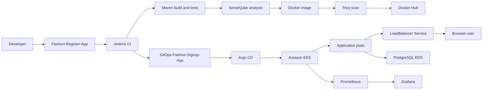

# Fashion Signup App: Project Overview

## Purpose

This project delivers a Java web application through an automated CI/CD and GitOps workflow on AWS. Application source and Kubernetes deployment configuration are maintained in separate GitHub repositories.

## Architecture

```text
Developer
 -> Fashion-Register-App
 -> Jenkins CI
 -> Maven build and tests
 -> SonarQube analysis and quality gate
 -> Docker image build
 -> Trivy vulnerability scan
 -> Docker Hub push
 -> GitOps-Fashion-Signup-App values.yaml update
 -> Argo CD
 -> Amazon EKS
 -> Kubernetes Deployment and Pods
 -> LoadBalancer Service
 -> Browser user
```

The application uses PostgreSQL on Amazon RDS. Database settings are supplied to pods through a Kubernetes Secret. Prometheus and Grafana provide operational visibility.

## Repositories

- `Fashion-Register-App`: Java application, Maven modules, Dockerfile, and Jenkins pipeline.
- `GitOps-Fashion-Signup-App`: Helm chart, deployment values, Deployment template, and LoadBalancer Service template.
- Parent repository: links both repositories as Git submodules through `.gitmodules`.

## Delivery Flow

1. Jenkins checks out the application repository from `main`.
2. Maven compiles the server and web modules and runs tests.
3. SonarQube analyzes the source and returns the configured quality-gate result.
4. Jenkins builds and scans a Docker image.
5. Jenkins pushes the image tag and `latest` to Docker Hub.
6. Jenkins updates the image tag in the GitOps Helm values file.
7. Argo CD detects the GitOps change and reconciles the Helm release in EKS.
8. Kubernetes rolls out the new pods and exposes the application through the LoadBalancer Service.

## External Access

The Helm chart creates a Kubernetes Service with `type: LoadBalancer`, port `8080`, and target port `8080`. AWS provisions the external endpoint, which forwards browser traffic to the application pods selected by the Service labels.

## Infrastructure

- Amazon VPC, subnets, security groups, EC2, EKS, and RDS PostgreSQL
- Jenkins master and build agent
- SonarQube with PostgreSQL support
- Docker Hub image registry
- Helm and Argo CD
- Prometheus and Grafana

## Ownership Boundaries

- Jenkins owns build, test, analysis, image creation, and the GitOps commit.
- GitHub stores source code and desired deployment configuration.
- Argo CD owns reconciliation from Git to Kubernetes.
- Kubernetes owns scheduling, rollout, and Service routing.
- RDS owns persistent relational data.


# Architecture Overview

## System Context

The Fashion Signup App is a Java web application deployed to Amazon EKS. Application source and deployment configuration are maintained in separate Git repositories.

## End-to-End Flow



## Repository Boundaries

### Application repository

`Fashion-Register-App` contains the Java source, Maven modules, Dockerfile, web assets, tests, and Jenkinsfile.

### GitOps repository

`GitOps-Fashion-Signup-App` contains the Helm chart, deployment values, Deployment template, and Service template. It defines the desired Kubernetes state.

## Runtime Components

| Component | Responsibility |
| --- | --- |
| Jenkins | Builds, tests, scans, packages, and updates the GitOps image tag |
| Docker Hub | Stores versioned application images |
| Argo CD | Reconciles GitOps configuration with the EKS cluster |
| Amazon EKS | Runs and rolls out the application pods |
| LoadBalancer Service | Provides the external application endpoint |
| PostgreSQL RDS | Stores application data |
| Kubernetes Secret | Supplies database connection values to pods |
| Prometheus and Grafana | Collects and presents operational metrics |

## Traffic and Data Flow

The Kubernetes Service receives external traffic on port `8080` and forwards it to application pods on their container port. The application reads `DB_URL`, `DB_USER`, and `DB_PASSWORD` from the `register-app-db` Secret and connects to PostgreSQL RDS.

## Ownership Model

- Jenkins owns CI and the GitOps commit.
- GitHub stores source and desired deployment state.
- Argo CD owns Git-to-cluster reconciliation.
- Kubernetes owns scheduling, rollout, and Service routing.
- RDS owns persistent relational data.

# DevOps Tools and Code Guide

## Purpose

This document explains what each tool contributes and where its configuration lives. It is a component guide, not a second architecture narrative.

## Source and Build

| Tool | Use in this project | Main location |
| --- | --- | --- |
| GitHub | Stores application and GitOps repositories | Repository remotes and `.gitmodules` |
| Java | Compiles and runs the application | Maven modules in `Fashion-Register-App` |
| Maven | Builds the server and web modules and runs tests | `pom.xml` |
| Jenkins | Executes the CI pipeline | `Jenkinsfile` |

The pipeline runs `mvn clean package` followed by `mvn test`. The Maven project contains `server` and `webapp` modules and produces the application artifacts.

## Quality and Security

### SonarQube

The Jenkinsfile runs the SonarQube Maven scanner and waits for the configured quality-gate result. The analysis task result and quality-gate result are separate values and must be reported separately.

### Trivy

Trivy scans the built image for `HIGH` and `CRITICAL` vulnerabilities before the image is pushed to Docker Hub.

## Container Delivery

The Dockerfile packages the web application for Tomcat. Jenkins builds an image using the release and Jenkins build number, then pushes both the immutable build tag and `latest` to Docker Hub. Local image copies are removed from the build agent after the push.

## Helm and Kubernetes

The GitOps chart uses four main inputs:

- `image`: repository, tag, and pull policy
- `replicaCount`: desired pod count
- `resources`: CPU and memory limits
- `databaseSecret`: Secret name and key mappings

`templates/deployment.yaml` creates the pods, injects database values, and exposes container port `8080`. `templates/service.yaml` creates a stable Service and requests an AWS LoadBalancer endpoint.

## Argo CD

Argo CD watches the GitOps repository. A new image tag changes the desired Deployment state; Argo CD detects the commit and reconciles the cluster. Kubernetes then performs the rollout.

## Monitoring

Prometheus collects cluster and workload metrics. Grafana queries Prometheus and presents dashboards. Monitoring resources are separate from the application Deployment and use their own namespace and Service configuration.

## Infrastructure Bootstrap

The EC2 user-data scripts install the supporting tools:

- EKS bootstrap host: AWS CLI, `kubectl`, and `eksctl`
- Jenkins master: Java and Jenkins service
- Jenkins agent: Java, Git, Docker, SSH, and build dependencies
- SonarQube host: PostgreSQL, Java 17, SonarQube, and its systemd service

# Final Project Synopsis

## Project Summary

The Fashion Signup App is a Java web application delivered through a CI/CD and GitOps workflow on AWS. The implementation separates application source from Kubernetes deployment configuration and uses Git as the source of deployment intent.

## Technology Stack

- GitHub for source and GitOps repositories
- Jenkins for CI automation
- Maven and Java for build and tests
- SonarQube for static analysis
- Docker and Docker Hub for image delivery
- Trivy for container vulnerability scanning
- Helm for Kubernetes packaging
- Argo CD for GitOps reconciliation
- Amazon EKS for application orchestration
- PostgreSQL RDS for persistent data
- Prometheus and Grafana for monitoring

## Delivery Sequence

1. A change is pushed to `Fashion-Register-App`.
2. Jenkins checks out the `main` branch and runs Maven build and tests.
3. SonarQube analyzes the source and returns the configured quality result.
4. Jenkins builds and scans a Docker image.
5. The image is pushed to Docker Hub with a build-specific tag.
6. Jenkins updates the image tag in `GitOps-Fashion-Signup-App`.
7. Argo CD detects the GitOps commit and synchronizes EKS.
8. Kubernetes rolls out the new pods behind a LoadBalancer Service.

## Application Runtime

The web application runs in Tomcat-based containers. Kubernetes maintains the requested replica count and routes traffic through a stable Service. Database connection values are injected from a Kubernetes Secret and point to PostgreSQL RDS.

## Resulting Operating Model

The pipeline provides a repeatable path from source change to running workload. Jenkins performs validation and delivery preparation; GitOps records the desired image version; Argo CD applies that version; Kubernetes manages runtime placement and rollout; monitoring provides operational visibility.
