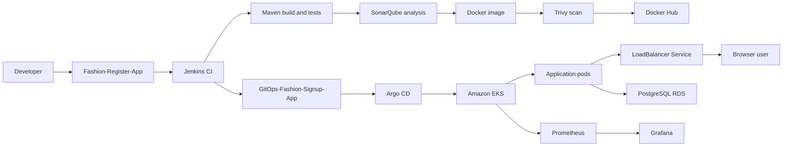

# Fashion Signup App: Project Overview

## Purpose

This project delivers a Java web application through an automated CI/CD and GitOps workflow on AWS. Application source and Kubernetes deployment configuration are maintained in separate GitHub repositories.

## Architecture

```text
Developer
 -> Fashion-Register-App
 -> Jenkins CI
 -> Maven build and tests
 -> SonarQube analysis and quality gate
 -> Docker image build
 -> Trivy vulnerability scan
 -> Docker Hub push
 -> GitOps-Fashion-Signup-App values.yaml update
 -> Argo CD
 -> Amazon EKS
 -> Kubernetes Deployment and Pods
 -> LoadBalancer Service
 -> Browser user
```

The application uses PostgreSQL on Amazon RDS. Database settings are supplied to pods through a Kubernetes Secret. Prometheus and Grafana provide operational visibility.

## Repositories

- `Fashion-Register-App`: Java application, Maven modules, Dockerfile, and Jenkins pipeline.
- `GitOps-Fashion-Signup-App`: Helm chart, deployment values, Deployment template, and LoadBalancer Service template.
- Parent repository: links both repositories as Git submodules through `.gitmodules`.

## Delivery Flow

1. Jenkins checks out the application repository from `main`.
2. Maven compiles the server and web modules and runs tests.
3. SonarQube analyzes the source and returns the configured quality-gate result.
4. Jenkins builds and scans a Docker image.
5. Jenkins pushes the image tag and `latest` to Docker Hub.
6. Jenkins updates the image tag in the GitOps Helm values file.
7. Argo CD detects the GitOps change and reconciles the Helm release in EKS.
8. Kubernetes rolls out the new pods and exposes the application through the LoadBalancer Service.

## External Access

The Helm chart creates a Kubernetes Service with `type: LoadBalancer`, port `8080`, and target port `8080`. AWS provisions the external endpoint, which forwards browser traffic to the application pods selected by the Service labels.

## Infrastructure

- Amazon VPC, subnets, security groups, EC2, EKS, and RDS PostgreSQL
- Jenkins master and build agent
- SonarQube with PostgreSQL support
- Docker Hub image registry
- Helm and Argo CD
- Prometheus and Grafana

## Ownership Boundaries

- Jenkins owns build, test, analysis, image creation, and the GitOps commit.
- GitHub stores source code and desired deployment configuration.
- Argo CD owns reconciliation from Git to Kubernetes.
- Kubernetes owns scheduling, rollout, and Service routing.
- RDS owns persistent relational data.


# Architecture Overview

## System Context

The Fashion Signup App is a Java web application deployed to Amazon EKS. Application source and deployment configuration are maintained in separate Git repositories.

## End-to-End Flow



## Repository Boundaries

### Application repository

`Fashion-Register-App` contains the Java source, Maven modules, Dockerfile, web assets, tests, and Jenkinsfile.

### GitOps repository

`GitOps-Fashion-Signup-App` contains the Helm chart, deployment values, Deployment template, and Service template. It defines the desired Kubernetes state.

## Runtime Components

| Component | Responsibility |
| --- | --- |
| Jenkins | Builds, tests, scans, packages, and updates the GitOps image tag |
| Docker Hub | Stores versioned application images |
| Argo CD | Reconciles GitOps configuration with the EKS cluster |
| Amazon EKS | Runs and rolls out the application pods |
| LoadBalancer Service | Provides the external application endpoint |
| PostgreSQL RDS | Stores application data |
| Kubernetes Secret | Supplies database connection values to pods |
| Prometheus and Grafana | Collects and presents operational metrics |

## Traffic and Data Flow

The Kubernetes Service receives external traffic on port `8080` and forwards it to application pods on their container port. The application reads `DB_URL`, `DB_USER`, and `DB_PASSWORD` from the `register-app-db` Secret and connects to PostgreSQL RDS.

## Ownership Model

- Jenkins owns CI and the GitOps commit.
- GitHub stores source and desired deployment state.
- Argo CD owns Git-to-cluster reconciliation.
- Kubernetes owns scheduling, rollout, and Service routing.
- RDS owns persistent relational data.

